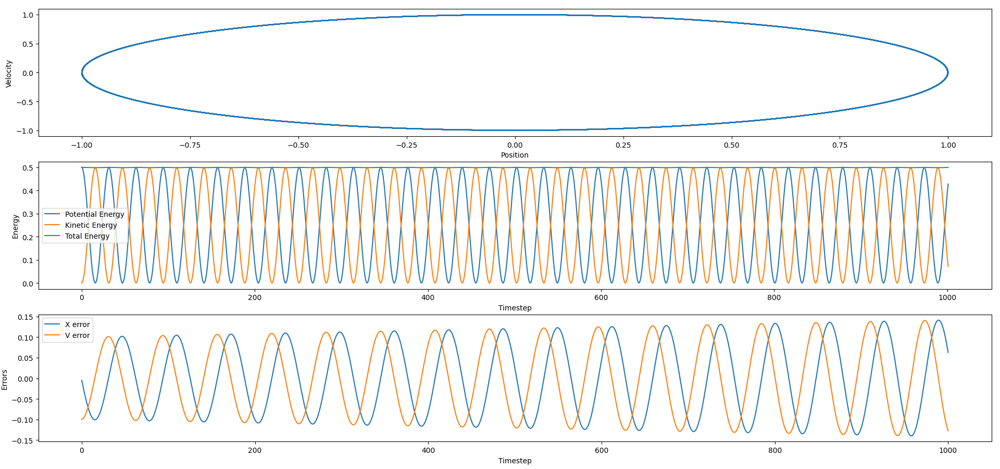

# StatMechDemos
 Coding excersizes for my statistical mechanics class.

 ## Molecular Dynamics

 Here, the Velocity Verlet algorithm is used to numerically solve for a harmonic oscillator's point in phase space at a given time. w and m are set to 1 for simplicity.

 $V(x) = 0.5*x^2$,
 
 $F(x) = -V'(x) = -x$

 $x(τ) = x(0) + v(0) * τ + 0.5* τ^2 * F(0)$
 
 $v(τ) = v(0) + 0.5 * (F(0)+F(τ)) * τ$

 For this simulation, $x(0)=1$, $v(0)=0$ and $dt=0.1$

 After calculating $x$ and $v$ after one timestep, the same equations can be applied repeatedly to extend the prediction to further lengths of time.

 The results are compared to the analytical solution for the classical harmonic oscillator, which is
 
 $x(t) = x(0) * cos(t) + v(0) * sin(t)$
 
 $v(t) = v(0) * cos(t) - x(0) * sin(t)$

 The error of the simulation oscilate within +/-0.1 of the analytical values, and the total energy is conserved, barring tiny fluctuations.

 
