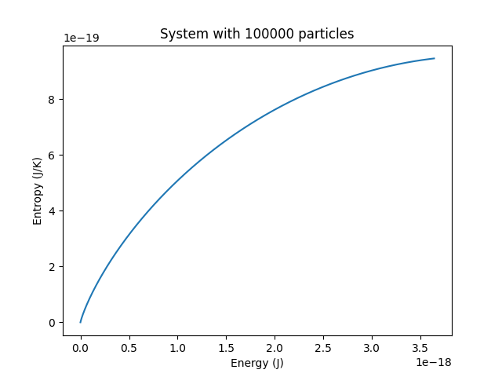
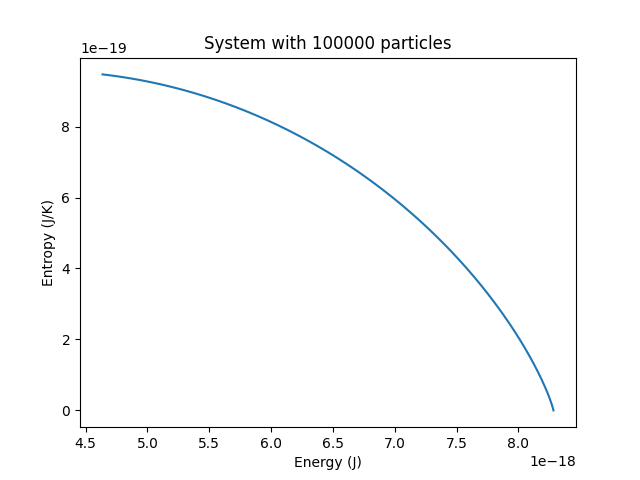
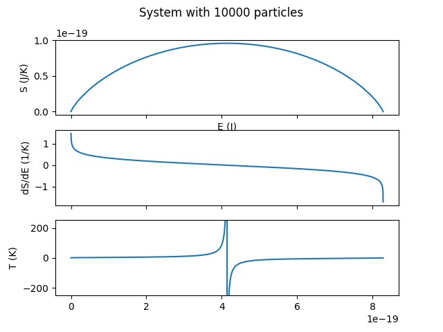
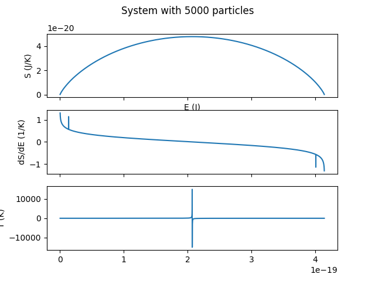
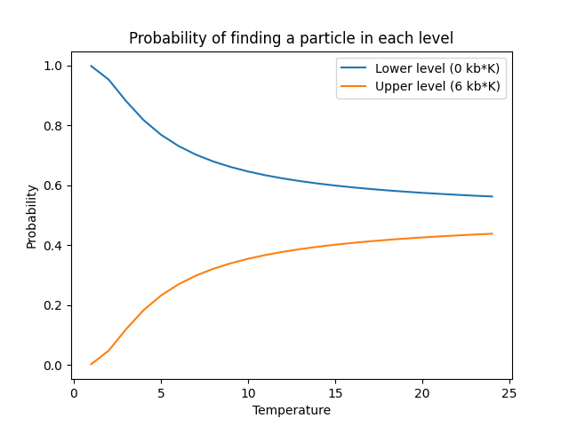
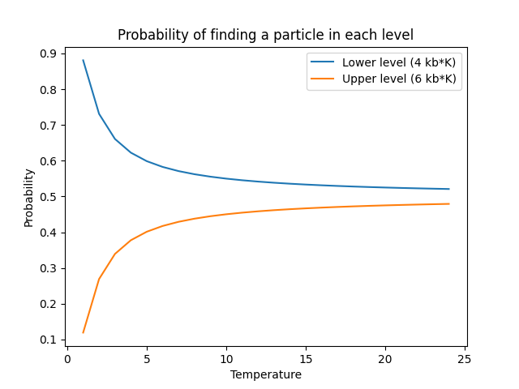

# StatMechDemos
 Coding excersizes for my statistical mechanics class.

 ## Contents
 [Harmonic Oscillator](#harmonic-oscillator) MD simulation for homework.\
 [Two Level System](#two-level-system) Project #1

 ## Harmonic Oscillator

 ### Requirements
 matplotlib\
 numpy

 Here, the Velocity Verlet algorithm is used to numerically solve for a harmonic oscillator's point in phase space at a given time. w and m are set to 1 for simplicity.

 $V(x) = 0.5*x^2$,

 $F(x) = -V'(x) = -x$

 $x(τ) = x(0) + v(0) * τ + 0.5* τ^2 * F(0)$

 $v(τ) = v(0) + 0.5 * (F(0)+F(τ)) * τ$

 For this simulation, $x(0)=1$, $v(0)=0$ and $dt=0.1$

 After calculating $x$ and $v$ after one timestep, the same equations can be applied repeatedly to extend the prediction to further lengths of time.

 The results are compared to the analytical solution for the classical harmonic oscillator, which is

 $x(t) = x(0) * cos(t) + v(0) * sin(t)$

 $v(t) = v(0) * cos(t) - x(0) * sin(t)$

 The error of the simulation oscilate within +/-0.1 of the analytical values, and the total energy is conserved, barring tiny fluctuations.

 

  Run with `./MD.py`

  ## Two-Level System

  ### Requirements
  matplotlib\
  numpy\
  rich (for progress bars)

  ### Theoretical Background
  This code calculates entropy by $k_b\ln(\Omega)$, where $\Omega$ is the number of configurations of the system for the given T, E, N, etc. $\Omega$ can be calculated by combinatorics: $\frac{(n+m)!}{n!m!}$, where $n$ and $m$ are the populations of the upper and lower level, respectively. However, this number becomes unweildy too quickly to use for all but small systems. Because $\ln\Omega$ is needed, we can use the sterling approximation: $\ln(n!)=\text{sterling}(n) = n\ln(n)-n$. Furthermore, we use log rules to separate components of the combinatorial calculation into 3 sterling numbers $\ln\Omega \approx \text{sterling}(n+m) - \text{sterling}(n) - \text{sterling}(m)$. This is much faster to calculate, so it is used by default by the code.

  A plot of the predicted occupancies of each level vs. T is also available. It demonstrates that because $\lim_{T\to\infty}p_j=1/Z$, and referring to the definition of $Z$, $\lim_{T\to\infty}\sum_ke^{-\beta E_k}=\sum_k1=k$, all levels are equally probable at high T. This means the configurations plotted on the $S(E)$ curve with upper level more occupied than the lower are only accessible at a negative temperature, as described by the definition $\frac{\partial S}{\partial E}=1/T$.

  A Monte Carlo simulation is also available. The probabilities for occupying a particular energy level is given by $p_j=\frac{e^{-\beta E_j}}{\sum_ke^{-\beta E_k}}$, where $\beta=1/k_bT$. Each particle "chooses" its level independently, and from the partial plot of $S(E)$ that results, the temperature recovered is approximately equal to the temperature specified to initialize the simulation.

  ### Implementation Notes
  Decimal types are used instead of floats because floats have very poor precision at the small scales required for this code, and Decimals allow arbitrary precision for arithmetic. This was especially important for the slope calculations for the $S(E)$ curve, where arithmetic with $\times 10^{-24}$-magnitude numbers led to DivideByZero errors when there shouldn't have been.

  For the Monte Carlo simulation, if a particle does not change it's level from the one it was initialized at, the entropy and energy calculations are skipped, because they would yield the same results as the previously calculated value. This increases the performance greatly, especially for large systems at low temperatures (initialized at $l=0$).

  The exact value of $\Omega$ can be requested, if possible. Details are described below.

  ### Instructions

  Here the entropy of a 2-level system can be explored by exposing customizable system sizes, energy levels and temperatures to the user.

  Available calculations are the $P_E(T)$ and $S(E)$ curves and a Monte Carlo simulation. These are available with the `-p`, `-s`, and `-m` flags, respectively.

  Here is an example of the Monte Carlo simulation with 100,000 particles. Energy levels and temperature are the default.

  ```
  ./levels.py -mn 100000
  Determining populations of energy levels: ━━━━━━━━━━━━━━━━━━━━━━━━━━━━━━━━━━━━━━━━ 100% 0:00:27
  The number of particles in the upper level is 43920 out of 100000 particles.
  This ratio is 0.4392, compared to the expected ratio of 0.4403.
  The numerically determined temperature is 24.55 K, compared to the expected temperature of 25 K.

  ```
  


  We can also specify that the simulation start with all particles in the upper level. We can also use a negative temperature.

  ```
  ./levels.py -m -n 100000 -t -25 -l 1
  Determining populations of energy levels: ━━━━━━━━━━━━━━━━━━━━━━━━━━━━━━━━━━━━━━━━ 100% 0:00:26
  The number of particles in the upper level is 55977 out of 100000 particles.
  This ratio is 0.5598, compared to the expected ratio of 0.5597.
  The numerically determined temperature is -24.97 K, compared to the expected temperature of -25 K.a
  ```
  

  The same rules are being applied in any of the above cases, which shows how negative temperatures can come about in cases of the system being initialized in a configuration inaccessable by thermal excitation.


  The program uses the sterling approximation by default to improve performance.

  A the default system with 10,000 particles completed instantaneously when only the approximation (`./levels.py -st 250`).

  

  In addition to the default, the exact value of $\Omega$ can be requested with the `-x` flag. The sterling approximation will be used if an overflow error is encountered. The transition point between the two methods can be seen with the following example due to the small kink formed in the $S(E)$ curve.
  ```
  ./levels.py -sxt 250
  Calculating S(E) curve: ━━━━━━━━━━━━━━━━━━━━━━━━━━━━━━━━━━━━━━━━ 100% 0:00:04
 ```
  
  The following example takes longer, but by saving the percent of the population in the upper level at which the overflow error occurs, the middle portion of the curve can be run only with the sterling approximation, only restarting exact calculations for $\Omega$ after reaching the complementary ratio that triggered the first overflow error.


  We can also see how reducing the gap between the energy levels allows the populations to approximately equalize at a lower temperature.

  `./levels.py -p`

  

  `./levels.py -pe  4 6`

  

  The view can be extended further with the `-t` flag.

  See the help, `./levels.py -h` for more information.
