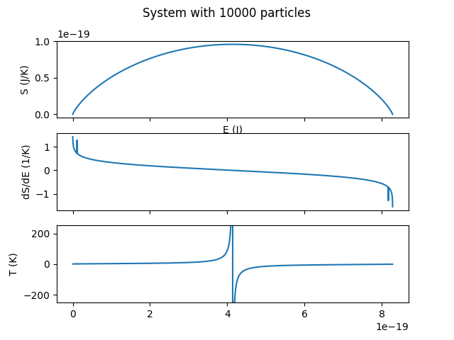

# StatMechDemos
 Coding excersizes for my statistical mechanics class.

 ## Contents
 [Harmonic Oscillator](#harmonic-oscillator) MD simulation for homework.\
 [Two Level System](#two-level-system) Project #1

 ## Harmonic Oscillator

 ### Requirements
 matplotlib\
 numpy

 Here, the Velocity Verlet algorithm is used to numerically solve for a harmonic oscillator's point in phase space at a given time. w and m are set to 1 for simplicity.

 $V(x) = 0.5*x^2$,
 
 $F(x) = -V'(x) = -x$

 $x(τ) = x(0) + v(0) * τ + 0.5* τ^2 * F(0)$
 
 $v(τ) = v(0) + 0.5 * (F(0)+F(τ)) * τ$

 For this simulation, $x(0)=1$, $v(0)=0$ and $dt=0.1$

 After calculating $x$ and $v$ after one timestep, the same equations can be applied repeatedly to extend the prediction to further lengths of time.

 The results are compared to the analytical solution for the classical harmonic oscillator, which is
 
 $x(t) = x(0) * cos(t) + v(0) * sin(t)$
 
 $v(t) = v(0) * cos(t) - x(0) * sin(t)$

 The error of the simulation oscilate within +/-0.1 of the analytical values, and the total energy is conserved, barring tiny fluctuations.

 

  ## Two-Level System

  ### Requirements
  matplotlib\
  numpy\
  rich (for progress bars)

  Here the entropy of a 2-level system can be explored by exposing customizable system sizes, energy levels and temperatures to the user.

  Available calculations are the $P_E(T)$ and $S(E)$ curves and a Monte Carlo simulation. These are available with the `-p`, `-s`, and `-m` flags, respectively.  

  Here is an example of the Monte Carlo simulation with 100,000 particles. Energy levels and temperature are the default.

  ```
  ./levels.py -mn 100000
  Determining populations of energy levels: ━━━━━━━━━━━━━━━━━━━━━━━━━━━━━━━━━━━━━━━━ 100% 0:00:27
  The number of particles in the upper level is 43920 out of 100000 particles.
  This ratio is 0.4392, compared to the expected ratio of 0.4403.
  The numerically determined temperature is 24.55 K, compared to the expected temperature of 25 K.

  ```
  


  We can also specify that the simulation start with all particles in the upper level. We can also use a negative temperature.

  ```
  ./levels.py -m -n 100000 -t -25 -l 1
  Determining populations of energy levels: ━━━━━━━━━━━━━━━━━━━━━━━━━━━━━━━━━━━━━━━━ 100% 0:00:26
  The number of particles in the upper level is 55977 out of 100000 particles.
  This ratio is 0.5598, compared to the expected ratio of 0.5597.
  The numerically determined temperature is -24.97 K, compared to the expected temperature of -25 K.a
  ```
  

  The same rules are being applied in any of the above cases, which shows how negative temperatures can come about in cases of the system being initialized in a configuration inaccessable by thermal excitation.


  The program uses the stirling approximation by default to improve performance. 

  A the default system with 10,000 particles completed instantaneously when only the approximation (`./levels.py -st 250`).
  

  In addition to the default, the exact value of omega can be requested with the `-x` flag. The stirling approximation will be used if an overflow error is encountered. The transition point between the two methods can be seen with the following example due to the small kink formed in the $S(E)$ curve.
  ```
  ./levels.py -sxt 250
  Calculating S(E) curve: ━━━━━━━━━━━━━━━━━━━━━━━━━━━━━━━━━━━━━━━━ 100% 0:00:04
 ```
  
  The following example takes longer, but by saving the percent of the population in the upper level at which the overflow error occurs, the middle portion of the curve can be run only witht he stirling approximation, only restarting exact calculations for omega after raching the complementary ratio that triggered the first overflow error.


  We can also see how reducing the gap between the energy levels allows the populations to approximately equalize at a lower temperature.

  `./levels.py -p`
  
  
  
  `./levels.py -pe  4 6`
  
  

  The view can be extended further with the `-t` flag.

  See the help, `./levels.py -h` for more information.

